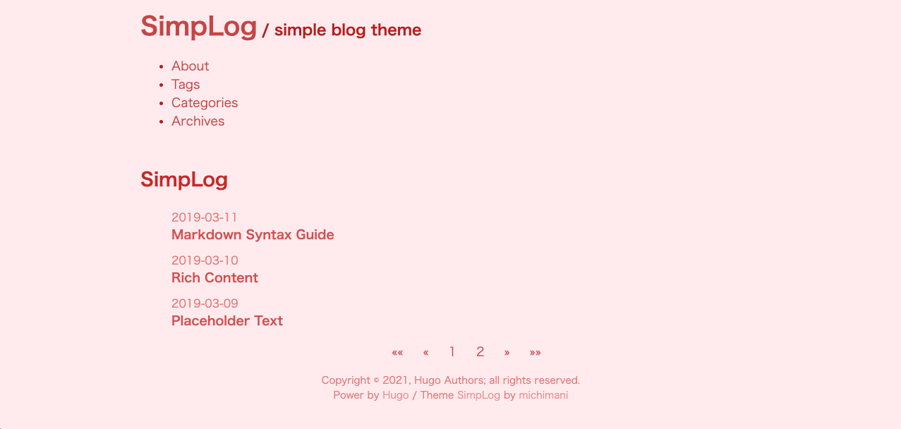
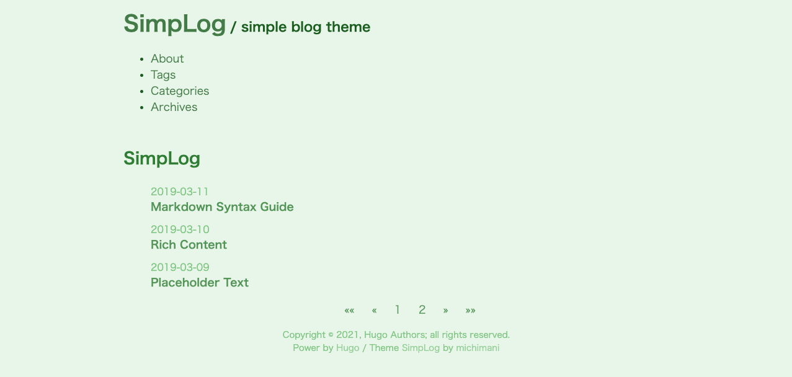

SimpLog
---
SimpLog is a simple blog theme for Hugo.


Demo site is [here](https://michimani.github.io/SimpLog/).

## Features

- Support tags, categories and archives page
- Google Analytics
- Responsive
- Show related tags and categories posts
- Some color theme

## Theme colors

- Default

    

- Dark

    

- Blue/Green/Red

    

    
    
    

## Installation

```bash
$ git submodule add https://github.com/michimani/SimpLog.git ./themes/SimpLog
```

